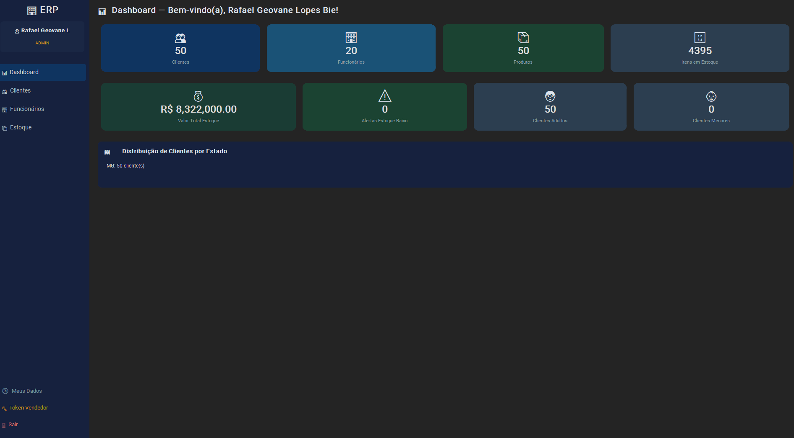
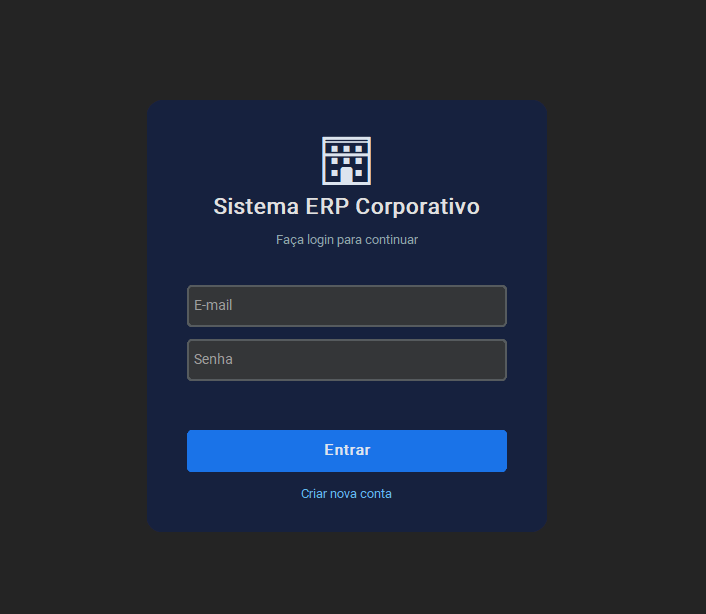
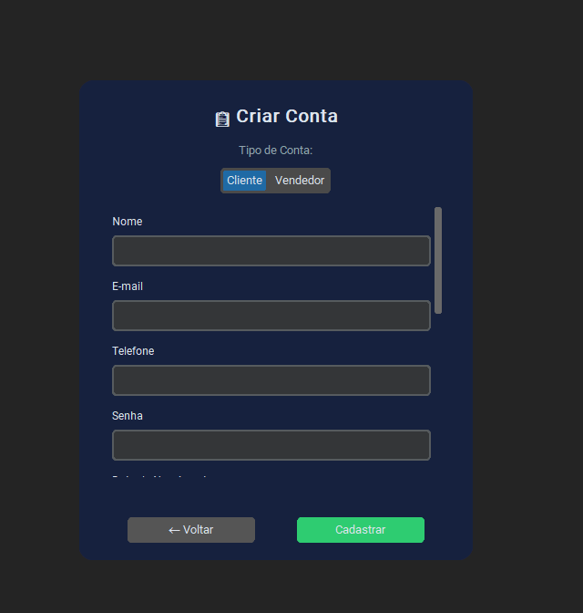
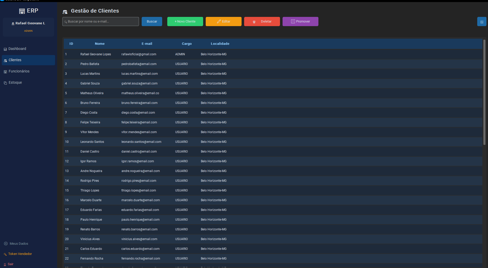
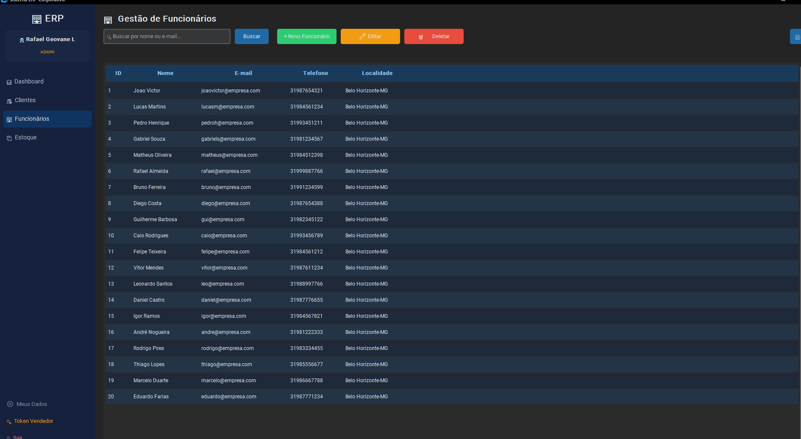
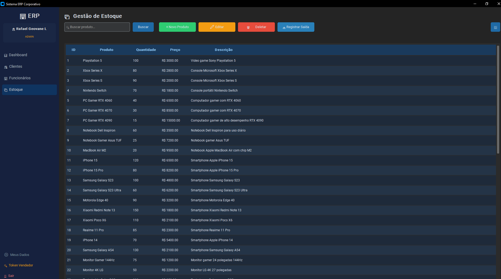

<p align="center">
  
  
  
  
  
</p>

<h1 align="center">🏢 Sistema ERP Corporativo</h1>

<p align="center">
  <b>Sistema completo de gestão empresarial com interface gráfica moderna.</b><br>
  Gerencie <b>clientes</b>, <b>funcionários</b>, <b>estoque</b> e <b>vendedores</b> em uma aplicação desktop profissional.
</p>

<p align="center">
  
</p>

---

## ✨ Funcionalidades

| Módulo | Descrição |
|--------|-----------|
| 🔐 **Autenticação** | Login seguro com hash SHA-256, cadastro com tipo de conta (Cliente/Vendedor) |
| 📊 **Dashboard** | Visão geral com estatísticas em tempo real — clientes, funcionários, estoque e valor total |
| 👥 **Gestão de Clientes** | CRUD completo com busca, edição, deleção e promoção a admin |
| 🏢 **Gestão de Funcionários** | Cadastro e gerenciamento de funcionários (acesso restrito ao admin) |
| 📦 **Gestão de Estoque** | Controle de produtos com entrada/saída, alertas de estoque baixo |
| 🔑 **Token de Vendedor** | Sistema de tokens para autorizar cadastro de vendedores |
| 🗺️ **Busca de CEP** | Integração com API ViaCEP para preenchimento automático de endereço |
| 📋 **Meus Dados** | Visualização dos dados pessoais do usuário logado |

---

## 📸 Screenshots

<details>
<summary><b>🔐 Tela de Login</b></summary>
<br>
<p align="center">
  
</p>
</details>

<details>
<summary><b>📝 Tela de Cadastro</b></summary>
<br>
<p align="center">
  
</p>
<p align="center"><i>Seleção de tipo de conta: Cliente ou Vendedor (com token)</i></p>
</details>

<details open>
<summary><b>📊 Dashboard</b></summary>
<br>
<p align="center">
  
</p>
<p align="center"><i>Visão geral com cards de estatísticas e distribuição por estado</i></p>
</details>

<details>
<summary><b>👥 Gestão de Clientes</b></summary>
<br>
<p align="center">
  
</p>
<p align="center"><i>Tabela com busca, edição, deleção e promoção de usuários</i></p>
</details>

<details>
<summary><b>🏢 Gestão de Funcionários</b></summary>
<br>
<p align="center">
  
</p>
<p align="center"><i>Gerenciamento completo de funcionários (acesso admin)</i></p>
</details>

<details>
<summary><b>📦 Gestão de Estoque</b></summary>
<br>
<p align="center">
  
</p>
<p align="center"><i>Controle de produtos com 50+ itens — consoles, smartphones, periféricos e mais</i></p>
</details>

---

## 🏗️ Arquitetura do Projeto

O sistema segue uma **arquitetura em camadas**, separando lógica de negócio da interface gráfica:

```
sistema-de-estoque/
│
├── main.py                     # 🚀 Ponto de entrada da aplicação
│
├── config/                     # ⚙️ Configurações e utilitários
│   ├── __init__.py             # Re-exporta constantes e módulos
│   ├── config.py               # Constantes, caminhos e cores do tema
│   ├── models.py               # Modelos de dados (Usuario, Administrador, Produto)
│   ├── seguranca.py            # Hash de senhas e validações
│   └── utils.py                # Funções utilitárias (JSON, logs)
│
├── services/                   # 💼 Camada de lógica de negócio
│   ├── auth_service.py         # Autenticação e login
│   ├── cliente_service.py      # CRUD de clientes + token de vendedor
│   ├── funcionario_service.py  # CRUD de funcionários + cadastro vendedor
│   └── estoque_service.py      # CRUD de estoque + alertas
│
├── gui/                        # 🖥️ Interface gráfica (CustomTkinter)
│   ├── app.py                  # Janela principal + sidebar de navegação
│   ├── components.py           # Componentes reutilizáveis (DataTable, StatCard, FormPopup)
│   ├── login_frame.py          # Tela de login e cadastro
│   ├── dashboard_frame.py      # Dashboard com estatísticas
│   ├── clientes_frame.py       # Gestão de clientes
│   ├── funcionarios_frame.py   # Gestão de funcionários
│   └── estoque_frame.py        # Gestão de estoque
│
├── database/                   # 🗄️ Banco de dados (JSON)
│   ├── cadastro.json           # Dados dos clientes
│   ├── funcionarios.json       # Dados dos funcionários/vendedores
│   └── estoque.json            # Dados dos produtos
│
├── logs/                       # 📄 Registros de atividades
│   ├── atividades.txt
│   ├── atividades_funcionarios.txt
│   └── atividades_estoque.txt
│
└── prints/                     # 📸 Screenshots da aplicação
```

---

## 🚀 Como Executar

### Pré-requisitos

- **Python 3.10+** instalado
- **pip** (gerenciador de pacotes Python)

### Instalação

```bash
# 1. Clone o repositório
git clone https://github.com/Faelzin09663/Sistema-de-estoque
cd sistema-de-estoque

# 2. Instale as dependências
pip install customtkinter requests

# 3. Execute a aplicação
python main.py
```

### Login Padrão (Admin)

| Campo | Valor |
|-------|-------|
| **E-mail** | `Seu email` |
| **Senha** | *(definida no cadastro)* |

---

## 🔐 Sistema de Permissões

| Role | Acesso |
|------|--------|
| **Admin** | Acesso total — CRUD completo, gerenciar funcionários, definir token de vendedor |
| **Vendedor** | Cadastro via token do admin, salvo em `funcionarios.json` |
| **Cliente/Usuário** | Acesso básico — visualizar dados, consultar estoque |

### Fluxo de Cadastro de Vendedor

```
Admin define token ➜ Vendedor seleciona "Vendedor" no cadastro ➜ Digita o token ➜ Conta salva em funcionários
```

---

## 🛠️ Tecnologias Utilizadas

<table>
  <tr>
    <td align="center"><br><b>Python 3</b></td>
    <td align="center"><br><b>CustomTkinter</b></td>
    <td align="center"><br><b>JSON</b></td>
    <td align="center"><br><b>ViaCEP API</b></td>
  </tr>
</table>

| Tecnologia | Uso |
|------------|-----|
| **Python 3.10+** | Linguagem principal |
| **CustomTkinter** | Framework GUI moderno com tema dark |
| **JSON** | Persistência de dados (banco de dados local) |
| **SHA-256** | Hash de senhas para segurança |
| **ViaCEP API** | Consulta automática de endereços por CEP |

---

## 📋 Funcionalidades Detalhadas

### 📊 Dashboard
- Cards com estatísticas em tempo real
- Total de clientes, funcionários, produtos e itens em estoque
- Valor total do estoque em R$
- Alertas de estoque baixo
- Distribuição de clientes por estado

### 👥 Clientes
- Tabela com ID, Nome, E-mail, Cargo e Localidade
- Busca por nome ou e-mail
- Cadastro com validação de e-mail e telefone
- Edição e deleção (admin)
- Promoção de usuário a admin

### 📦 Estoque
- Catálogo completo de produtos com preços em R$
- Registro de saídas com controle de quantidade
- Alertas visuais para estoque baixo (≤ 5 unidades)
- Cadastro de novos produtos (admin)

---

## 👨‍💻 Autor

Desenvolvido por **Rafael Geovane Lopes Bie**

<p>
  <a href="mailto:rafawloficial@gmail.com">
    
  </a>
</p>

---

## 📄 Licença

Este projeto está sob a licença **MIT**. Veja o arquivo [LICENSE](LICENSE) para mais detalhes.

---

<p align="center">
  <b>⭐ Se este projeto te ajudou, deixe uma estrela!</b>
</p>
